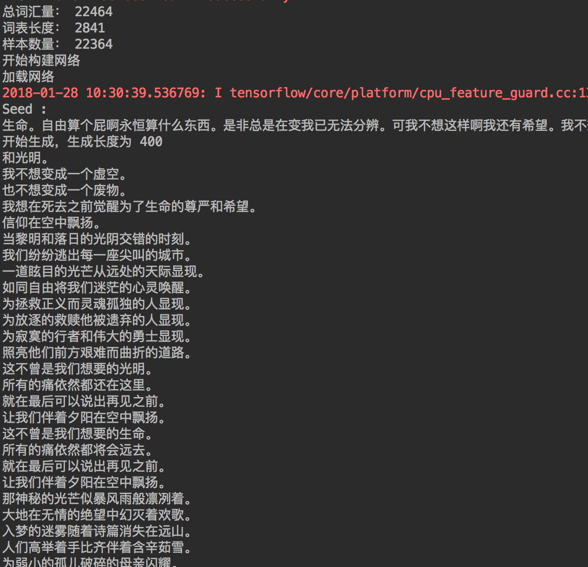

# LSTM_generation
这是一个`keras`中`LSTM`的入门实例。

## 1.文件结构
* train_data
  * new_wangfeng.txt
  * preprocessing.py
  * wangfeng.txt
* generation
* main.py
* weights-improvement=26-0.105659.hdf5（[百度网盘](https://pan.baidu.com/s/1eT3fTWQ)）

1. train_data文件夹下是用作训练的数据，wangfeng.txt是原始数据，
preprocessing.py是很简单的文本预处理，new_wangfeng.txt是真  
正的训练数据
2. generation.py是生成脚本，用来生成歌词。(可直接运行)
3. main.py是训练脚本
4. weights-improvement=26-0.105659.hdf5是训练好的网络（28代左右，训练了12个小时）

## 2.网络结构
此实例基于keras，网络构建十分简单。
```python
model.add(Embedding(n_vocab, 512, input_length=seq_length))
model.add(LSTM(512, input_shape=(seq_length, 512), return_sequences=True))
model.add(LSTM(1024))
model.add(Dense(n_vocab, activation='softmax'))
```

## 3.实验结果
将代码clone下来后，直接运行main.py开始训练。
如果觉得训练时间太长，可以下载已训练好的[网络](https://pan.baidu.com/s/1eT3fTWQ),放置同级目录下  
然后直接运行generation.py(脚本里面加载的网络文件名称要统一)会出现如下结果：  


## 4.作者联系方式
邮箱：651010646@qq.com  
欢迎讨论，共同学习。